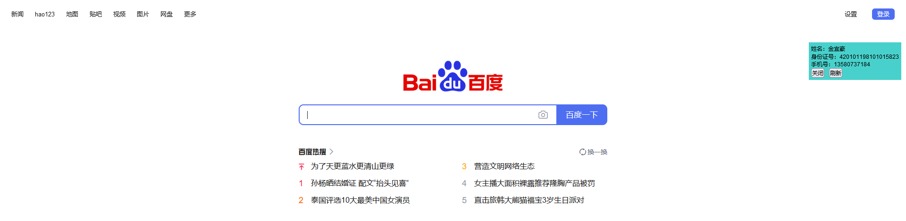
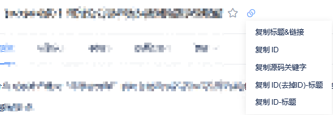

 
  <!--  -->

  <!-- &#xa0; -->

  <!-- <a href="https://tampermonkeyscripts.netlify.app">Demo</a> -->

<h1 align="center">Tampermonkey Scripts</h1>

  

  

  

  

  <!--  -->

  <!--  -->

  <!--  -->

<!-- Status -->

<!-- <h4 align="center"> 
	🚧  Tampermonkey Scripts 🚀 Under construction...  🚧
</h4> 

 -->

  <a href="#dart-about">About</a> &#xa0; | &#xa0; 
  <a href="#sparkles-features">Features</a> &#xa0; | &#xa0;
  <a href="#memo-license">License</a> &#xa0; | &#xa0;
  <a href="https://github.com/ddki" target="_blank">Author</a>

 

## :dart: About ##

My Tampermonkey Scripts.

## :sparkles: Features ##

:heavy_check_mark: 获取阿里云token;\
:heavy_check_mark: 页面生成身份证号小组件;\
:heavy_check_mark: 腾讯Tapd复制标题;\
:heavy_check_mark: 夸克网盘-分享按时间倒序排序;

### [获取阿里云token](https://greasyfork.org/zh-CN/scripts/470260-%E8%8E%B7%E5%8F%96%E9%98%BF%E9%87%8C%E4%BA%91token)

👀 查看源码：[aliyundrive_token.js](js/aliyundrive_token.js)

### [页面生成身份证号小组件](https://greasyfork.org/zh-CN/scripts/441488-%E9%A1%B5%E9%9D%A2%E7%94%9F%E6%88%90%E8%BA%AB%E4%BB%BD%E8%AF%81%E5%8F%B7%E5%B0%8F%E7%BB%84%E4%BB%B6)

👀 查看源码：[idcard_page_card.js](js/idcard_page_card.js)

在页面上添加一个生成了虚拟姓名、身份证号、手机号的小组件。

### [夸克网盘-分享按时间倒序排序](https://greasyfork.org/zh-CN/scripts/530361-%E5%A4%B8%E5%85%8B%E7%BD%91%E7%9B%98-%E5%88%86%E4%BA%AB%E6%8C%89%E6%97%B6%E9%97%B4%E5%80%92%E5%BA%8F%E6%8E%92%E5%BA%8F)

👀 查看源码：[panquark_share_createtime_desc.js](js/panquark_share_createtime_desc.js)

在用户故事和缺陷详情里的复制菜单下新增了两个菜单：

- 复制 ID(去掉ID)-标题
- 复制 ID-标题

### [腾讯Tapd复制标题](https://greasyfork.org/zh-CN/scripts/471192-%E8%85%BE%E8%AE%AFtapd%E5%A4%8D%E5%88%B6%E6%A0%87%E9%A2%98)
👀 查看源码：[tpad_copy_menu.js](js/tpad_copy_menu.js)

## :memo: License ##

This project is under license from GPL-3.0. For more details, see the [LICENSE](https://raw.githubusercontent.com/ddki/tampermonkey-scripts/master/LICENSE) file.

Made with :heart: by <a href="https://github.com/ddki" target="_blank">ddki</a>

&#xa0;

<a href="#top">Back to top</a>
